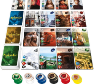
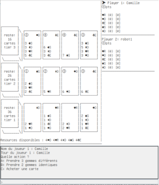

# Cahier des Charges

## Présentation générale

La présentation ci-dessous est à mettre en lien avec le principe de fonctionnement du jeu Splendor, et doit donc être lue après la lecture des règles de jeu. Elle donne une description des différents fichiers source qui vous sont fournis et sont à compléter.

A noter que ce projet contient de nombreuses classes, nous vous recommandons de partager le travail, i.e., 1 ou  2 membre(s) du groupe pour réaliser les implémentations et la vérification du bon fonctionnement du code. Certains choix d’implémentation peuvent faire appel à des notions que nous n’avons pas vues en cours et qui peuvent donc nécessiter la lecture de la documentation officielle de Java.

Par ailleurs, bien que le jeu soit un jeu de cartes avec de nombreux visuels, vous ne devez pas développer une interface graphique pour ce projet. La visualisation se fera avec le terminal, et la majorité des codes sont déjà fournis.

Dans un  premier temps, nous allons considérer une version simplifiée du jeu pour laquelle vous ne devez pas implémenter les éléments suivants

- les cartes Nobles
- les jetons Or (aussi appelés les jetons Joker)

## Détails du cahier des charges

L’implémentation va contenir un ensemble de classes dont les trois principales sont les classes `Board`, `Game`, et `Player`. Elles vont permettre de matérialiser le plateau de jeu et de réaliser une partie en impliquant les différents joueurs. Ces classes interagissent et utilisent d’autres classes du projet dont la description est également détaillée.

Vous devez respecter le cahier des charges : respecter le nom des classes et le nom des variables permet d’assurer le fonctionnement avec le code qui est déjà fourni. === Cela est OBLIGATOIRE en vue d’une potentielle vérification automatique de votre code ===. Merci de faire une relecture de votre code en vérifiant ce point avant votre rendu.

### 1.	La classe Board

L'objectif de la classe `Board` est de préparer le tableau de jeu, et de le mettre à jour au fur et à mesure que les joueurs prennent des ressources et/ou des cartes.

Le plateau de jeu (ci-contre) est constitué de quatre éléments principaux : 
1.	3 piles de cartes développement (`DevCard`) faces cachées qui correspondent à trois niveaux,
2.	les cartes cartes développement (`DevCard`) faces visibles que les joueurs peuvent acheter,
3.	les tuiles nobles (`Noble`, classe qui n’est pas à implémenter dans la version simplifiée), et 
4.	les jetons ressources (`Resources`).

#### Initialisation
Pendant l’étape d’initialisation, les étapes suivantes doivent être réalisées :
- création des 3 piles de cartes développement faces cachées
- rendre visible 4 cartes de développement pour chaque niveau
- initialiser le nombre de ressources en fonction du nombre de joueurs (voir la règle de jeu pour les détails)

Lors du lancement d’une partie de jeu sous BlueJ, une implémentation réussie doit vous donner un écran similaire à la capture ci-dessous :

#### Cartes développement (`DevCard`)

Les caractéristiques des cartes développements et des nobles sont données par le fichier [stats.csv](./stats.csv). A l’initialisation du plateau de jeu, il faut lire ce fichier csv dont les éléments sont séparés par des virgules. La lecture du fichier pourra se faire à l’aide de la classe Scanner utilisée précédemment dans des TPs.
Chaque carte a quatre caractéristiques qui doivent être lues dans le fichier csv puis stocker dans la structure de données correspondantes :

- son niveau (1/2/3) indiqué dans la colonne `tier`. Le niveau 0 correspond aux nobles qui ne sont pas utilisés dans la version simplifiée.
- son coût indiqué par les colonnes `coutDIAMOND`, `coutSAPPHIRE`, `coutEMERALD`, `coutRUBY` et `coutONYX`. Chaque colonne indique le nombre de ressources nécessaires pour acheter la carte. Ses ressources sont à payer avec les jetons ressources. Les bonus présents sur les cartes développement déjà achetées permettent de réduire le coût d’achat d’une ressource.

- ses (éventuels) points de prestiges indiqués par la colonne `points`.
- le bonus de la carte (`resourceType`).

Chaque caractéristique devra correspondre à un attribut dans la classe `DevCard`. Un accesseur sera implémenté pour chaque attribut.
Les méthodes afin de visualiser les cartes sont à compléter une fois l’implémentation de la classe terminée `DevCard`.

- la méthode `toStringArray`, qui permet de visualiser une carte de développement en affichant toutes ses informations. Il faut décommenter le code en commentaires (/* … */) et remplacer les morceaux de code **“ACOMPLETER”** en s’aidant des commentaires (//) et supprimer les lignes indiquées par (**//-- ASUPPRIMER**).
- la méthode `toString`, qui permet d’obtenir une représentation visuelle de la carte. Il faut décommenter le code en commentaires (/* … */) et remplacer les morceaux de code **“ACOMPLETER”** en s’aidant des commentaires (//) et supprimer les lignes indiquées par (**//-- ASUPPRIMER**).

#### Liste de ressources (`Resources`)
La principale difficulté dans la classe `DevCard`  est l’implémentation du coût de la carte, qui sera modélisée par la classe `Resources` (aussi utilisée pour représenter les jetons sur le plateau de jeu) pour lequel nous vous proposons deux options d’implémentations.
Option 1 : implémentation de la classe `Resources` avec comme attribut **un tableau** qui maintient l’ordre des éléments. En d’autres termes, chaque colonne correspond à un type de ressources. Par exemple, le premier élément du tableau représente le coût en diamant, le deuxième en saphire, le troisième en émeraude, le quatrième en ruby, la dernière en onyx.
Option 2 : utilisation d’une table de hachage implémentée avec la classe [HashMap](https://docs.oracle.com/en/java/javase/21/docs/api/java.base/java/util/HashMap.html) que nous n’avons pas vue en cours. En particulier, la classe `Resources` pourra étendre la classe HashMap. La classe `HashMap` permet une implémentation efficace d’une table d’association. L’objectif est de pouvoir accéder à une valeur (ici, un nombre de ressources disponibles) en fonction d’une clé (ici le type de ressource). Ce choix d’implémentation peut nécessiter aussi de travailler avec d’autres classes de l’API Java (notamment Set).

La classe `Resources` devra comporter également :

- une méthode `getNbResource` qui en fonction du type de ressource retourne le nombre de ressources disponible.
- une méthode `setNbResource` qui permet de modifier le nombre de ressources d’un type donné (mutateur).
- une méthode `updateNbResource` qui prend en paramètre un type de ressource et une quantité (v), et qui ajoute (v>0) ou supprime (v<0) cette quantité à la ressource correspondante. Le nombre de ressources disponibles pour chaque type ne pourra pas être inférieur à 0.
- une méthode `getAvailableResources` qui retourne les types de ressources (indice ou nom en fonction du choix d’implémentation) pour lesquels des ressources sont disponibles.

Afin de vous aider dans cette implémentation, nous vous fournissons l’énumération `Resource`, qui pourra être utilisée notamment pour les visualisations du jeu dans le terminal, et éventuellement l’implémentation avec la table de hachage.

#### Piles de cartes développement faces cachées

Afin de modéliser une pile de cartes faces cachées, nous vous proposons d’utiliser soit un tableau de carte développements soit une structure de données [Stack](https://docs.oracle.com/en/java/javase/21/docs/api/java.base/java/util/Stack.html) que nous n’avons pas vu en cours.
Option 1 : un tableau
Si vous utilisez un tableau, vous devez connaître à l’initialisation du tableau le nombre de cartes par niveau. Cette information doit être extraite du fichier stats.csv avant la lecture et la sauvegarde des cartes.
Option 2 :  Stack
La classe Stack permet d’implémenter une structure de données de type pile (LIFO: Last In First Out). Avant son utilisation, vous devez vous familiariser avec les méthodes présentes dans cette classe et faire le lien avec le cours de structure de données : 

 ](./images/ss_stack.png)

Les trois piles, correspondant aux trois niveaux, peuvent être stockées dans un tableau ou une **ArrayList**. On nommera cet attribut `stackCards`.

#### Cartes faces visibles

Pour modéliser les cartes faces visibles, nous proposons l’utilisation d’**un tableau à deux dimensions** `visibleCards` de 3 lignes, une pour chaque niveau, et 4 colonnes, une pour les cartes retournées. Les cartes faces visibles sont à lire à partir de la structure de données représentant la pile de cartes faces cachées. Attention à l’initialisation (après la lecture du fichier csv), il faudra mélanger les cartes pour chaque niveau afin que les cartes ne soient pas tirées dans l’ordre du fichier csv.

#### Interaction avec le plateau de jeu

La classe Board doit implémenter l’interface `Displayable`, dont le code source est déjà fourni. La classe Board doit comporter 
- une méthode `getNbResource` qui en fonction du type de ressource retourne le nombre de ressources disponible sur le plateau de jeu.
- une méthode `setNbResource` qui permet d’initialiser le nombre de ressources d’un type donné.
- une méthode `updateNbResource` qui prend en paramètre un type de ressource et une quantité (v), et qui ajoute (v>0) ou supprime (v<0) cette quantité à la ressource correspondante sur le plateau de jeu. Le nombre de ressources disponibles pour chaque type ne pourra pas être inférieur à 0.
- une méthode `getAvailableResources` qui retourne les types de ressources (indice ou nom en fonction du choix d’implémentation) pour lesquels des ressources sont disponibles.
- une méthode `getCard` qui permet de retourner une carte de développement en fonction du niveau (numéro de ligne) et de la colonne où elle est placée. L’utilisateur devra donner ses coordonnées pour obtenir les cartes.
- une méthode `updateCard` qui prend en paramètre une carte de développement et tire une nouvelle carte à la place de cette carte là. Si la pile de carte pour le niveau correspondant est vide, une référence nulle est utilisée.
- une méthode `drawCard` qui permet de retourner la première carte de la pile face cachée. Si aucune carte n’est disponible dans la pile (i.e., pile vide), la méthode retourne une référence nulle.
- une méthode `canGiveSameTokens` qui retourne s’il est possible ou pas de prendre deux fois le même jeton d’une ressource donnée (pour rappel, il faut qu’il reste au moins 4 jetons de cette ressource disponible sur le plateau).
- une méthode `canGiveDiffTokens` qui vérifie pour une liste de ressources si suffisamment de jetons sont disponibles sur le plateau.

Il faudra également compléter les trois méthodes qui permettent de visualiser le plateau de jeu :
- la méthode `deckToStringArray`, qui permet de visualiser la pile de cartes faces cachées pour un niveau donné. Le nombre de cartes faces cachées est indiqué dans la visualisation. Vous devez donc modifier la ligne de code “int nbCards = 0”  en remplaçant “0” par le nombre actuel de cartes encore disponible.
- la méthode `resourcesToStringArray`, qui permet de visualiser les ressources disponibles. Il faut décommenter le code en commentaires (/* … */) et remplacer les morceaux de code “ACOMPLETER” en s’aidant des commentaires (//). 
- la méthode boardToStringArray, qui permet de visualiser l’ensemble du plateau de jeu. Cette méthode utilise le code de la classe `Display`, qui est déjà donné et ne doit pas être modifié. Comme précédemment, il faut décommenter le code en commentaires (/* … */) et remplacer les morceaux de code “ACOMPLETER” en s’aidant des commentaires (//). 

### 2.	La classe `Game`

La classe `Game` permet de réaliser une partie à 2, 3 ou 4 joueurs. La liste des attributs et un main sont déjà donnés. La liste des attributs ne doit pas être modifiée.

#### Initialisation

La première étape est d’implémenter le **constructeur** de classe `Game`. Le constructeur prend en paramètres le nombre de joueurs. Si le nombre de joueurs n’est pas compris entre 2 et 4, une exception de type `IllegalArgumentException` doit être lancée avec un message personnalisé pour l’utilisateur du jeu. La liste des joueurs `players` et le plateau de jeu `board` doivent être initialisés. Par défaut, nous considérons que le premier joueur est humain (`HumanPlayer`), et les autres joueurs sont des robots (`DumbRobotPlayer`).
Vous implémenterez également les méthodes `getNbPlayers` qui retourne le nombre de joueurs.

#### Phase de jeu

La méthode `play` permet d’implémenter une phase de jeu pour chacun des joueurs. Tant qu’il n’y a pas de gagnant, chaque joueur peut effectuer un tour de jeu qui consiste dans cette version simplifiée à (i) prendre des jetons ressources ou acheter une carte développement (`move`), et (ii) défausser des jetons ressources si le joueur en a plus de 10 (`discardToken`).

La méthode `move` va permettre au joueur de choisir le type d’actions qu’il souhaite réaliser (`chooseAction`), puis de réaliser cette action (`process`), puis d’afficher l’action réalisée.
Afin de réaliser l’implémentation des différents codes, nous vous demandons d’implémenter une interface `Action`, qui imposera la redéfinition des méthodes `process` (il faut réfléchir aux paramètres de cette méthode) et la méthode `toString`. Cette interface sera implémentée par quatre classes que vous devez implémenter : `PickSameTokensAction` (prendre deux jetons de la même ressource), `PickDiffTokensAction` (prendre trois jetons de ressources différentes), `BuyCardAction` (acheter une carte développement), `DiscardTokensAction` (défausser des jetons), et `PassAction` (passer son tour).

#### Fin du jeu 
Afin de simuler la fin du jeu, deux méthodes seront utilisées
- la méthode `isGameOver`, qui retourne “vraie” si un joueur a plus de 15 points de prestige
- a méthode `gameOver`, qui félicite et affiche le nom du gagnant. Il faut penser à gérer le [cas d’égalité](https://www.regledujeu.fr/splendor/#:~:text=le%20joueur%20concern%C3%A9.-,III%20%E2%80%93%20Fin%20de%20la%20partie,-Lorsqu%E2%80%99un%20joueur%20atteint).

### 3.	Les joueurs

(i) La classe `Player`
Vous devez commencer par implémenter une classe `Player`, qui sert à regrouper les caractéristiques communes à tous les joueurs.
On considère que chaque joueur est représenté par
- un identifiant `id`
- un nom `name`
- son nombre de points de prestige `points`
- les cartes achetées `purchasedCards`, qui sera implémenté à l’aide d’une **ArrayList**, et
- les ressources achetées **resources** (de type `Resources`)

La classe `Player` sera complétée par
- des accesseurs pour le nom et le nombre de points
- une méthode `getNbTokens`, qui retourne le nombre total de ressources achetées
- une méthode `getNbPurchasedCards`, qui retourne le nombre total de cartes achetées par le joueur
- une méthode `getNbResource` qui retourne le nombre de ressources achetées pour un type donné
- une méthode `getAvailableResources`, qui retourne la liste des ressources disponibles
- une méthode `getResFromCards`, qui retourne le nombre de ressources d’un type donné présents sur les cartes achetées
- une méthode `updateNbResource` qui prend en paramètre un type de ressource et une quantité (v), et qui ajoute (v>0) ou supprime (v<0) cette quantité à la ressource correspondante. Le nombre de ressources disponibles pour chaque type ne pourra pas être inférieur à 0.
- une méthode `updatePoints`, qui incrémente le nombre de points prestige acquis par le joueur.
- une méthode `addPurchasedCard`, qui permet d’ajouter une carte donnée à la liste des cartes achetées par le joueur.
- une méthode `canBuyCard` qui vérifie si le joueur a assez de ressources pour acheter une carte donnée

La méthode `toStringArray` === (déjà présente) === permet de visualiser les informations sur un joueur. Pour cette méthode, il faut décommenter le code en commentaires (/* … */) et remplacer les morceaux de code “ACOMPLETER” en s’aidant des commentaires (//). 

La classe `Player` imposera également la redéfinition des méthodes `chooseAction` et `chooseDiscardingTokens` dont l’implémentation dépendra du type de joueurs.

(ii) Le joueur robot stupide `DumbRobotPlayer`
Un identifiant et un nom sont donnés lors de l’initialisation d’une instance de la classe.
Pour implémenter la méthode `chooseAction` qui retourne le type d’action choisi (`Action`), nous considérons qu’un joueur robot stupide essayera toujours d’effectuer dans cet ordre là les actions suivantes :

- bacheter une carte sur le plateau (en commençant par celle de plus haut niveau)
- acheter deux jetons ressources de même type
- acheter des jetons ressources de type différents
- passer son tour

Les jetons à retirer (si le nombre est supérieur à 10) est réalisé de manière aléatoire dans la méthode `chooseDiscardingTokens`, qui retourne la liste des ressources à supprimer (`Resources`).

(iii) Le joueur humain `HumanPlayer`
Les mêmes méthodes que pour le `DumbRobotPlayer` sont à implémenter, mais il faut demander à l’utilisateur ces choix, et vérifier s’ils sont bien exécutables.

